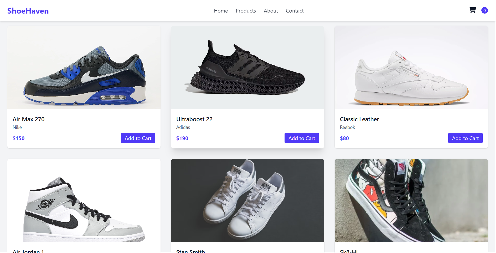
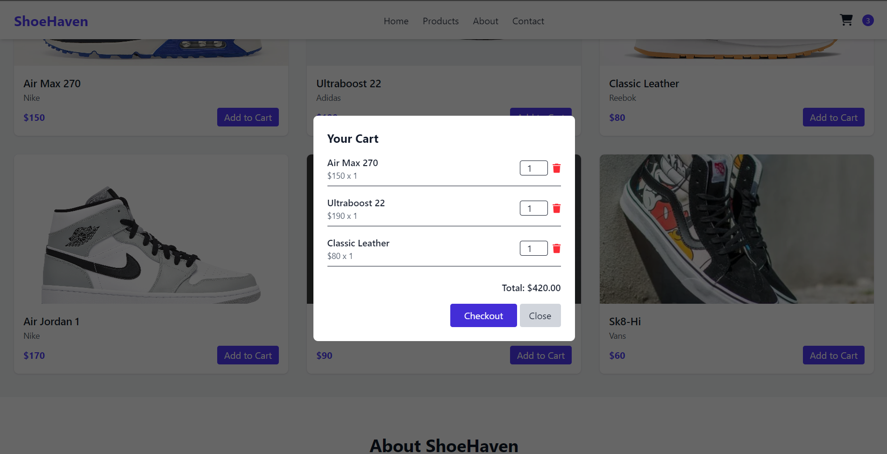

# 👟 ShoeHaven - Online Sneaker Store

Welcome to **ShoeHaven**, a modern, clean, and responsive sneaker store built with HTML, Tailwind CSS, PostCSS, and Stripe for secure checkout.

---

## Features

-  Product catalog with add-to-cart functionality
-  Modal-based shopping cart with live item updates
-  Secure Stripe Checkout integration
-  Responsive design with Tailwind CSS
-  Search functionality
-  Built without React or frameworks – just HTML + JS

---

##  Screenshots

  



---

##  Technologies Used

- HTML5 / JavaScript
- Tailwind CSS (via PostCSS)
- Stripe Checkout API
- Font Awesome
- Node.js + Express (for backend)

---

##  Project Structure

OnlineStore/
├── public/
│ ├── index.html # Main website
│ └── style.css # Generated Tailwind styles
├── src/
│ └── style.css # Source with @tailwind directives
├── tailwind.config.js # Tailwind config
├── postcss.config.js # PostCSS config
├── package.json # Project metadata + scripts
└── server.js # Stripe checkout backend


---

##  Getting Started

### 1. Clone the Repository

```bash
git clone https://github.com/yourusername/OnlineStore.git
cd OnlineStore
```
### 2. Install Dependencies
```bash
npm install
```
### 3. Start Tailwind Watcher
```bash
npm run watch
```
This will build public/style.css from src/style.css and keep it updated on changes.

### 4. Start Backend Server
```bash
node server.js
```
This runs the Express server handling Stripe sessions on http://localhost:3000.

### 5. Open the Site
Open public/index.html in your browser or use a local static server.

 Stripe Setup
Replace the Stripe publishable key in index.html

Replace the secret key in .env file

Get keys at dashboard.stripe.com

### Future Improvements
Product backend (Node or Django)

Order history & user auth

Admin dashboard to manage inventory

Dark mode toggle

### License
MIT License © 2025 Marth Ely
